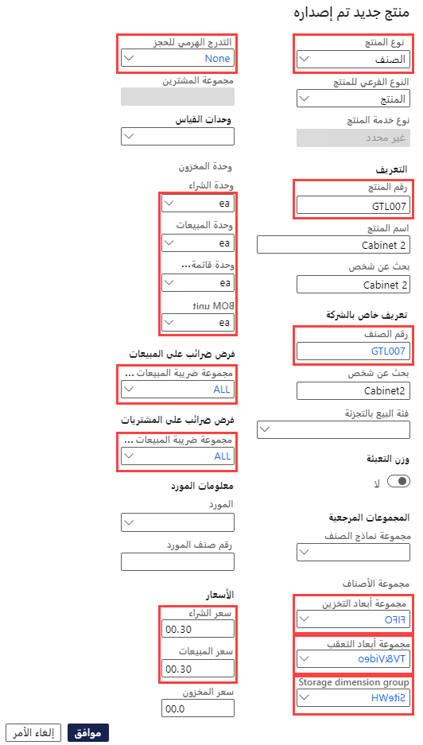
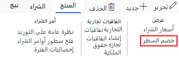

---
lab:
    title: 'المعمل 3: إنشاء عرض منتج بأحجام وألوان مختلفة'
    module: 'الوحدة 1: تعرف على أساسيات Microsoft Dynamics 365 Supply Chain Management'
---

# الوحدة 1: تعرف على أساسيات Microsoft Dynamics 365 - Supply Chain Management

## المعمل 3 - إنشاء عرض منتج بأحجام وألوان مختلفة

## الأهداف

في Contoso Entertainment System USA (USMF)، تحتاج إلى إنشاء عنصر جديد لتكوين جديد للخزانة ليتم شراؤه من المورّدين.

## إعداد المعمل

   - **الزمن المقدر**: 10 دقائق

## الإرشادات

1. في صفحة Finance and Operations الرئيسية، أعلى اليسار، تحقق من أنك تعمل مع شركة USMF.

1. إذا لزم الأمر، حدد الشركة ومن القائمة، حدد **USMF**.

1. في الجزء العلوي الأيسر، حدد القائمة على شكل هامبرجر **توسيع جزء التنقل**.

1. في جزء التنقل، حدد **الوحدات** >  **إدارة معلومات المنتج،** ثم ضمن فئة **المنتجات**، حدد **المنتجات الصادرة**.

1. في صفحة تفاصيل المنتج الصادر، في القائمة العلوية، حدد **+ جديد**.

1. في جزء إصدار منتج جديد، في قائمة **نوع المنتج**، تحقق من تحديد **العنصر**.

1. في قائمة **نوع المنتج الفرعي**، تحقق من تحديد **المنتج**.

1. حدد القائمة **مجموعة بُعد التعقب،** ثم حدد **لا شيء.**

1. ضمن **المعرف**، في المربعين **رقم المنتج** و**رقم العنصر**، أدخل **GTL007**.

1. في المربع **اسم المنتج**، أدخل **الخزانة 2**.

1. ضمن **المجموعات المرجعية**، حدد قائمة **مجموعة نماذج العنصر**، ثم حدد **الوارد أولاً يصرف أولاً**.

1. حدد قائمة **مجموعة العناصر** ثم حدد **التلفزيون والفيديو**.

1. حدد قائمة **مجموعة أبعاد التخزين**، ثم حدد **SiteWH**.

1. ضمن **وحدات القياس**، تحقق من تعيين القيم التالية:

    | **الإعداد**| **القيمة**|
    | :--- | :--- |
    | وحدة المخزون| الكل|
    | وحدة الشراء| الكل|
    | وحدة المبيعات| الكل|
    | وحدة BOM| الكل|

1. ضمن **ضرائب المبيعات،** حدد القائمة **مجموعة ضريبة المبيعات للعناصر،** ثم حدد **الكل.**

1. ضمن **ضرائب المشتريات،** حدد القائمة **مجموعة ضريبة المبيعات للعناصر**، ثم حدد **الكل.**

1. ضمن الأسعار، في المربع سعر الشراء، أدخل 30.00.

1. في المربع سعر المبيعات، أدخل 30.00.

1. يجب أن يبدو منتجك الجديد كالتالي:

    

1. حدد **موافق**.

1. لضمان إنهاء المنتج، في الشريط الشريطي، أسفل **صيانة**، حدد **التحقق من الصحة**.

    

1. تحقق من تقديمك مع شعار المعلومات الذي يؤكد أنه تم التحقق من صحة جميع قيم الحقول المطلوبة.

    

1. أغلق كل الصفحات وارجع إلى الصفحة الرئيسية.
