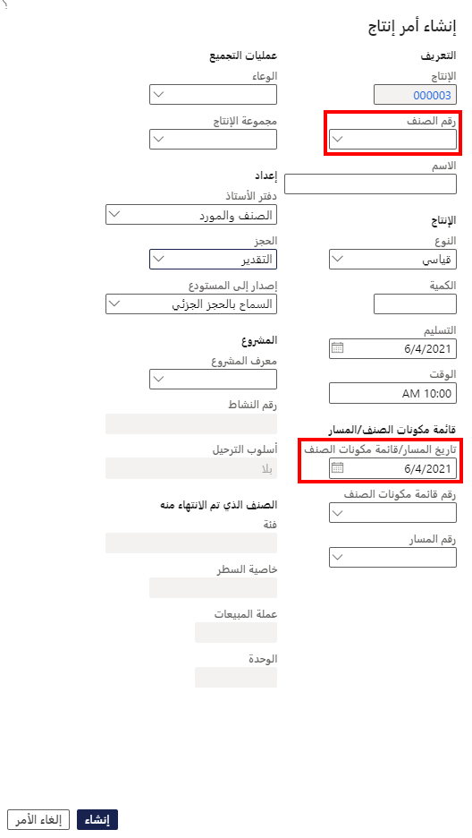

---
lab:
    title: 'المعمل 6: إنشاء أمر إنتاج'
    module: 'الوحدة 1: تعرف على أساسيات Microsoft Dynamics 365 Supply Chain Management'
---

## معمل 6 - إنشاء أمر إنتاج

## الأهداف

يحتوي أمر الإنتاج على معلومات حول ما سيتم إنتاجه والكمية المطلوب إنتاجها وتاريخ الانتهاء المخطط له. يحتوي أيضًا على معلومات حول المواد التي يجب استهلاكها والعملية التي يجب اتباعها لإنتاج العنصر.

يجب عليك إنشاء أمر إنتاج جديد لشركتك.

## إعداد المعمل

   - **الزمن المقدر**: 5 دقائق

## الإرشادات

1. في صفحة Finance and Operations الرئيسية، أعلى اليسار، تحقق من أنك تعمل مع شركة USMF.

1. إذا لزم الأمر، حدد الشركة ومن القائمة، حدد **USMF**.

1. في جزء التنقل الأيمن، حدد **الوحدات** > **التحكم في الإنتاج** >  **أوامر الإنتاج** >  **كل أوامر الإنتاج**.

1. في القائمة العلوية، حدد **أمر إنتاج جديد**.

1. ضمن **المعرف**، في المربع **رقم العنصر**، أدخل **D0001**، ثم حدد العنصر المحدد.

1. ضمن **الإنتاج**، في مربع **التسليم**، حدد تاريخًا بعد شهر واحد من تاريخ اليوم.  
    يشير تاريخ التسليم إلى موعد انتهاء أمر الإنتاج للتسليم في الوقت المحدد. يمكن استخدام هذا التاريخ في عملية الجدولة. على سبيل المثال، يمكنك جدولة الطلب بأثر رجعي من تاريخ التسليم.

1. في مربع **الكمية**، أدخل **20**.

1. ضمن **مكونات العنصر/المسار**، يعرض حقل رقم قائمة مكونات العنصر تلقائيًا رقم أي قائمة مكونات عنصر نشطة للعنصر الحالي، ولكن يمكنك تغيير قائمة مكونات العنصر لأمر الإنتاج عن طريق تحديد قائمة مكونات عنصر نشطة من قائمة إصدارات قائمة مكونات العنصر المعتمدة. يعرض حقل رقم المسار تلقائيًا رقم أي مسار نشط للعنصر الحالي، ولكن يمكنك تغيير المسار لأمر الإنتاج بتحديد مسار نشط من قائمة إصدارات المسار المعتمدة.

    

1. حدد **إنشاء**.
