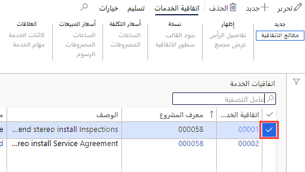
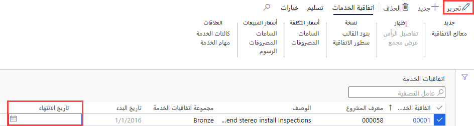

---
lab:
    title: 'المعمل 7: إنشاء أمر عمل مخطط'
    module: 'الوحدة 1: تعرف على أساسيات Microsoft Dynamics 365 Supply Chain Management'
---

## معمل 7 - إنشاء أمر عمل مخطط

## الأهداف

تصف أوامر الصيانة الموضوعة في النظام أعمال الصيانة أو الإصلاح المطلوبة للأصل وتستخدم لتعيين الموارد المناسبة لإكمال طلب الصيانة. لدى شركتك عقد خدمة مستمر وتحتاج إلى التأكد من إنشاء أوامر الخدمة المخططة لدعم الخدمة المتوقعة لبنود العقد.

## إعداد المعمل

   - **الزمن المقدر**: 10 دقائق

## الإرشادات

1. في صفحة Finance and Operations الرئيسية، أعلى اليسار، تحقق من أنك تعمل مع شركة USMF.

1. إذا لزم الأمر، حدد الشركة ومن القائمة، حدد **USMF.**

1. في جزء التنقل الأيمن، حدد **الوحدات** >  **إدارة الخدمات** >  **اتفاقيات الخدمة** >  **اتفاقيات الخدمة**.

1. حدد مربع الاختيار في العمود الأول لاتفاقية الخدمة الأولى.

    

1. حدد مربع **تاريخ الانتهاء** واحذف القيمة الحالية، ثم في القائمة العلوية، حدد **حفظ**.  
 تتم إزالة تاريخ الانتهاء بحيث يمكن إنشاء أمر خدمة جديد لهذه الاتفاقية.

    

1. في القائمة العلوية، حدد **تسليم**.

1. في الشريط الشريطي، ضمن **إنشاء**، حدد **أوامر الخدمة المخططة**.

1. في جزء إنشاء أوامر الخدمة، ضمن " **الفترة"**، قم بتعيين **من تاريخ** إلى تاريخ اليوم و**إلى تاريخ** إلى يومين من تاريخ اليوم.

1. ضمن **سجل المعلومات**، حدد مفتاح التبديل **عرض سجل المعلومات** لتعيينه على **نعم**.  
سيعرض هذا قائمة بأوامر الخدمة التي تم إنشاؤها في الاتفاقية.

1. ضمن **تضمين أنواع المعاملات**، حدد مفتاح التبديل **الساعة** لتعيينه على **نعم**.  
تمثل أنواع الحركات البنود التي تم إنشاؤها في اتفاقية الخدمة، ويقوم كل نوع حركة تحدده بإنشاء العديد من أوامر الخدمة، بناءً على الفاصل الزمني للخدمة المحدد في بند اتفاقية الخدمة.

1. ضمن **الخيارات**، حدد مفتاح التبديل **مستمر** لتعيينه على **نعم**.  
يُستخدم هذا لإنشاء أي أوامر خدمة مفقودة من سلسلة مستمرة من أوامر الخدمة.

1. حدد **موافق**.
